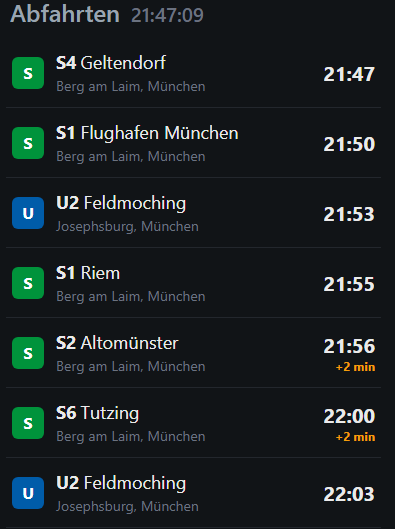

# mvg-departures

Kompakter Abfahrtsmonitor fuer MVG U-Bahn und S-Bahn (Muenchen), primaer fuer mobile Nutzung optimiert.

## Features

- Konfigurierbare Stationsliste (`config.yaml`) mit Typ (UBAHN/SBAHN/TRAM/BUS)
- Ausschluss-Filter pro Station: nur unerwuenschte Zielrichtungen werden ausgeblendet,
  neue/unbekannte Ziele werden automatisch weiter angezeigt
- Profile zur Gruppierung von Stationen (z.B. "Hinfahrt" und "Rückfahrt")
  - Klickbare Kacheln zum Profilwechsel (nur bei >1 Profil)
  - URL-Param `?profile=<name>` + Auto-Refresh
- Zwei Endpunkte:
  - `/` — mobile-optimierte HTML-Ansicht mit Auto-Refresh (alle 60s per Meta-Refresh)
  - `/api/departures` — JSON-Ausgabe derselben Daten
- Anzeige von Linie, Ziel, Abfahrtszeit, Verspaetung und Stoerungsmeldungen
- Visuelle Unterscheidung von U-Bahn (blau) und S-Bahn (gruen) per Icon



## Konfiguration

Siehe `config.yaml`:

```yaml
refresh_seconds: 60
cache_seconds: 20
departures_limit: 10

profiles:
  - name: "Hinfahrt"
    stations:
      - name: "Josephsburg, München"
        type: "UBAHN"
        exclude_destinations:
          - "Messestadt Ost"
          - "Messestadt West"
      - name: "Berg am Laim, München"
        type: "SBAHN"
        exclude_destinations:
          - "Erding"
          - "Markt Schwaben"
  - name: "Rückfahrt"
    stations:
      - name: "Grosshadern, München"
        type: "UBAHN"
        exclude_destinations: []
```

`exclude_destinations` filtert per exaktem `destination`-Stringvergleich. Alles was
NICHT in der Liste steht, wird angezeigt — so fallen Linienaenderungen/Umleitungen
sofort auf, statt lautlos verschwunden zu sein.

## Lokal starten

```bash
pip install -r requirements.txt
uvicorn app.main:app --reload
```

## Docker

```bash
docker build -t mvg-departures .
docker run -p 8000:8000 -e TZ=Europe/Berlin -v $(pwd)/config.yaml:/app/config.yaml mvg-departures
```

## Deployment

Siehe `docker-compose.yml` im Repo als Referenz. Beispiel (Owner anpassen):

```yaml
services:
  mvg-departures:
    image: ghcr.io/skoelle/mvg-departures:latest
    container_name: mvg-departures
    ports:
      - "8000:8000"
    volumes:
      - ./config.yaml:/app/config.yaml:ro
    environment:
      - TZ=Europe/Berlin
    restart: unless-stopped
    labels:
      - "com.centurylinklabs.watchtower.enable=true"
```

## CI/CD

`.github/workflows/build.yml`:

- Baut bei jedem Push auf `main` das Docker-Image und pusht es nach
  `ghcr.io/<owner>/<repo>:latest` sowie mit Short-SHA-Tag
- Anschliessender Cleanup-Job loescht alte Image-Versionen in der GHCR-Package-Registry
  und behaelt nur die letzten 4 Versionen (`min-versions-to-keep: 4`)

### Voraussetzung

Repo-Settings → Actions → General → Workflow permissions auf
"Read and write permissions" stellen, sonst schlaegt der Push nach GHCR fehl.

## mvg api

https://www.mvg.de/api/bgw-pt/v3/locations?query=Josephsburg \
https://www.mvg.de/api/bgw-pt/v3/locations?query=Berg%20am \
https://www.mvg.de/api/bgw-pt/v3/departures?globalId=de:09162:1220&limit=10&transportTypes=UBAHN \
https://www.mvg.de/api/bgw-pt/v3/departures?globalId=de:09162:910&limit=10&transportTypes=SBAHN

## Endpunkte

| Route | Beschreibung |
|---|---|
| `/` | HTML-Ansicht, mobile-optimiert, Auto-Refresh alle 60s |
| `/?profile=<name>` | HTML-Ansicht für ein bestimmtes Profil |
| `/api/departures` | JSON-Liste aller gefilterten Abfahrten (erstes Profil als Fallback) |
| `/api/departures?profile=<name>` | JSON-Liste für ein bestimmtes Profil |
| `/healthz` | Healthcheck fuer Docker/Watchtower |

## Projektstruktur

```
mvg-departures/
├── app/
│   ├── __init__.py
│   ├── main.py            # FastAPI-App, Endpunkte, Caching
│   ├── config.py          # Config-Loader (YAML → Dataclasses)
│   └── templates/
│       └── index.html     # Jinja2-Template (Mobile-UI)
├── config.yaml            # Stationskonfiguration
├── docker-compose.yml     # Deployment-Beispiel
├── requirements.txt       # Python-Dependencies
├── Dockerfile
├── .dockerignore
├── .gitignore
├── AGENTS.md
├── SPEC.md
├── renovate.json
└── .github/workflows/
    └── build.yml          # CI/CD: Docker-Build + GHCR-Push
```

## Tech-Stack

- **Runtime**: Python 3.14
- **Framework**: FastAPI + Uvicorn
- **Templating**: Jinja2 (server-seitig)
- **MVG-API**: `mvg` Python-Client (oeffentlich, kein Auth noetig)
- **Config**: YAML via `pyyaml`
- **Container**: Docker (python:3.14-slim)

## Caching

- **Station-ID**: In-memory Dict, lifetime=Session (loest Station-Namen auf)
- **Abfahrten**: In-memory Dict, TTL=`cache_seconds` (Default: 20s) pro Station+Typ
- Keine Persistenz → Neustart = Cache-Verlust

## Einschraenkungen

- Kein WebSocket/Live-Updates (nur periodischer Meta-Refresh)
- Keine Datenbank (nur In-Memory)
- Kein Test-Framework vorhanden
- Ein `config.yaml` pro Deployment (kein Multi-Tenancy)

## Lizenz

MIT License - Copyright (c) 2026 Stefan Koelle (https://stefankoelle.de)
